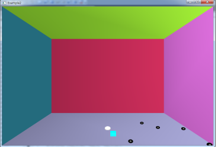

# OpenGL Project
> _C++, OpenGL library_  를 이용해 윈도우 어플리케이션을 제작한 프로젝트입니다.

[](license.txt)




## 프로젝트 설명

컴퓨터 그래픽스 수업에서 진행한 OpenGL 학기말 프로젝트입니다.

## 게임 설명

- 게임 요약 : 제한 시간 내에 장애물들을 피해서 아이템을 먹어라!

- 게임 장르 : 액션 게임.

- 게임 조작: ① 키보드: w(위로 이동),s(아래로 이동),a(왼쪽이동), d(오른쪽 이동), 스페이스(점프)
<br> ② 마우스: 드래그해서 시야방향 조작, 왼쪽 클릭(발사체 발사) 

- 게임 목표 : 제한시간 내에 정해진 아이템들을 일정 개수 이상 먹게 되면 승리하게 된다.

## 구현 내용

### 프로젝트 완성도

- 제안서에서 계획한 필수 구현 요소  <br>
[주인공 물체, 장애물, 조명(덫에 의해서 조명이 완전히 꺼지거나 완전히 밝아져서 하얗게 보이게 함, 평상시 배경조명 ,이동 불가), 아이템, 주인공들과 각 물체의 충돌체크, 아이템 효과(발사체, 무적, 속도증가), 맵 만들기, 점프 ] -> 100% 구현 완료


### 프로젝트 분담 역할

- 장성우: 적 장애물, 적 장애물과 주인공 충돌체크, 적 장애물 특수효과(발사체, 이동속도), 아이템 (이동속도2배, 주인공 발사체, 무적) , 시간에 따라 적 증가
- 이성욱: 정사각형, 주인공, 트랩, 조명, 화면 이동시 주인공 제외 전체 객체 이동 , 마우스 드래그로 화면 회전 

## 실행 방법


1. [git clone](https://github.com/jangseongwoo/OpenGL-project.git) 을 하세요.
```sh
git clone https://github.com/jangseongwoo/OpenGL-project.git
```

2. Visual studio의 프로젝트 열기로  _source_ 를  열어주세요.

3. Visual studio로 프로젝트를 컴파일 및 빌드 해주시면 실행됩니다.

## 개발 환경

- 사용 OS : 윈도우7 64bit
- 개발 툴 : Visual Studio 2014

## 정보

프로젝트에 대한 더 자세한 정보를 원하신다면,  폴더 내에 있는 _컴퓨터 그래픽스 최종 결과 보고서.hwp_ 를 참조해주세요.

장성우 – [@facebook](https://www.facebook.com/profile.php?id=100007028118707&ref=bookmarks) – seongwoo.dev@gmail.com

MIT 라이센스를 준수하며 ``LICENSE``에서 자세한 정보를 확인할 수 있습니다.

[https://github.com/jangseongwoo/github-link](https://github.com/jangseongwoo/github-link)

<!-- Markdown link & img dfn's -->
[npm-image]: https://img.shields.io/npm/v/datadog-metrics.svg?style=flat-square
[npm-url]: https://npmjs.org/package/datadog-metrics
[npm-downloads]: https://img.shields.io/npm/dm/datadog-metrics.svg?style=flat-square
[travis-image]: https://img.shields.io/travis/dbader/node-datadog-metrics/master.svg?style=flat-square
[travis-url]: https://travis-ci.org/dbader/node-datadog-metrics
[wiki]: https://github.com/yourname/yourproject/wiki
